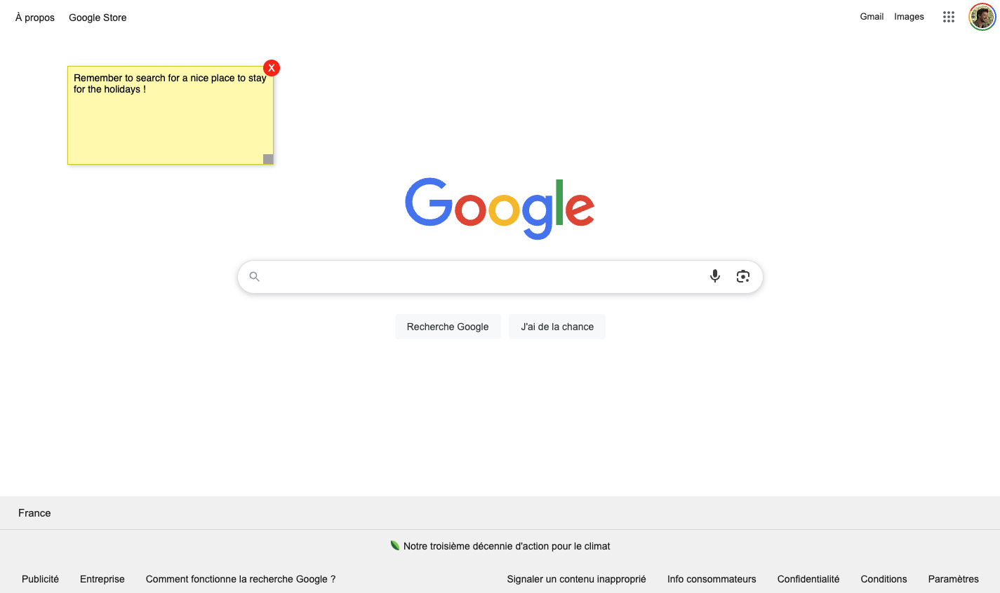

# 📝 Sticky Notes on Page – Chrome Extension

**Sticky Notes on Page** is a lightweight Chrome extension that lets you add editable, draggable, and resizable post-it-style notes to any website.  
All notes are saved automatically and restored per page.

---

## ✨ Features

- 🖱️ Add a new sticky note with one click (via extension icon)
- 💬 Write and edit notes freely
- 📌 Drag and move notes anywhere on the page
- ↘️ Resize notes with a bottom-right handle
- 💾 Auto-save content, position, and size per URL
- 🧽 Delete notes with a simple trash button
- 🎨 Customize the default background color (in the options page)
- 🔁 Notes are restored every time you revisit the same page

---

## 📸 Screenshot

---

## ⚙️ How to Install (Development Mode)

1. Clone or download this repository
2. Go to `chrome://extensions/` in your Chrome browser
3. Enable **Developer mode** (top right)
4. Click **Load unpacked**
5. Select the extension folder (containing `manifest.json`, etc.)
6. The extension icon will appear in the Chrome toolbar

---

## 🧪 How to Use

- Click the extension icon to add a sticky note
- Start typing – changes are saved automatically
- Drag to move the note wherever you want
- Use the corner handle to resize it
- Click the 🗑️ button to delete a note
- Visit the **Options page** to set a default background color

---

## 🧰 Built With

- Chrome Extensions API (Manifest V3)
- HTML / CSS / JavaScript
- `chrome.storage` for syncing data
- `content_scripts` & `scripting.executeScript`

---

## 🧑‍💻 Feel free to improve it!

This project is intentionally simple and open-ended.  
If you’re a developer and want to contribute, extend or remix this extension — **go for it!** ✨

Feel free to:

- Fork this repo
- Add your own spin or improvements
- Fix anything clunky or make it smarter
- Translate it, restyle it, or add new features

If you do something cool, **let me know** — I'd love to feature your version or merge improvements.

---

## 💡 Feature ideas & enhancements

Here are some ideas for future updates or community contributions:

- 🧠 **Per-note colors**: choose color per sticky
- 📆 **Reminders / due dates**: be notified for time-based notes
- 🧲 **Snap to grid** or alignment guides
- 📥 **Export / import** notes across devices
- 💻 **Cloud sync** across multiple Chrome profiles
- 🔒 **Private / locked notes** with password toggle
- ⌨️ **Keyboard shortcuts** to add/edit/delete notes
- 🗺️ **Global dashboard**: view all memos from all URLs
- 🌍 **Per-domain templates** (ex: meeting prep for Zoom, daily goals on Gmail)
- 🖼️ **Custom fonts, emojis, or images** in notes
- 📦 **PWA version** for outside-the-browser usage

> Feel free to open an issue or a PR if you want to discuss any of these!

---

## 👨‍💻 Author

**Olivier Ben**  
🌐 [Portfolio](https://olyvier.com)  
📬 [Contact me](mailto:hello@olyvier.com)

---

## 📝 License

[MIT](LICENSE) – Free to use and modify 🚀
